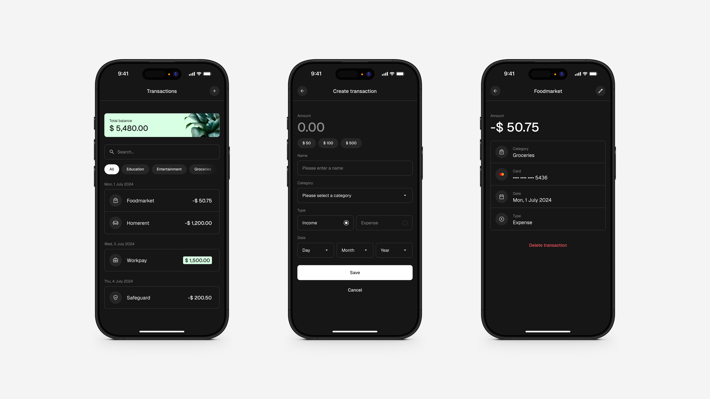

# Mintly

This app project is a personal exercise in test-driven development, centered on mastering CRUD operations. Designed as a learning project, it follows a structured process where each feature is developed independently to ensure a modular and maintainable codebase. The development process includes:

1. Defining a user story
2. Creating a wireframe
3. Designing the layout
4. Breaking down into components
5. Building a static version
6. Writing component tests
7. Implementing data flow

## Table of Contents

1. [Description](#description)
2. [Design](#design)
3. [Features](#features)
4. [Backlog](#backlog)
5. [How to use](#how-to-use)
6. [Dependencies](#dependencies)
7. [Tech Stack](#tech-stack)

## Description

Mintly helps users effortlessly track, manage, and analyze their expenses and savings, supporting healthier financial habits and smarter decision-making. The app provides tools for recording, editing, deleting, and filtering transactions, along with detailed transaction insights and budget summaries for a comprehensive financial overview.

## Design

The complete styleguide including fonts, colors, icons and general design principles can be found in this Figma file: [Styleguide](https://www.figma.com/design/DimQ0kYK6oqva5Zy1L4Hzv/Mintly-Styleguide?node-id=2062-350)

## Features

| Id  | User Story                                                                |                           Wireframe                            |                           Layout                            |                           Components                            | Static version |  Tests  | Data flow |
| :-: | ------------------------------------------------------------------------- | :------------------------------------------------------------: | :---------------------------------------------------------: | :-------------------------------------------------------------: | :------------: | :-----: | :-------: |
|  1  | [Transactions List](./assets/features/01_transactions-list/README.md)     |  [Link](./assets/features/01_transactions-list/wireframe.png)  |  [Link](./assets/features/01_transactions-list/layout.png)  |  [Link](./assets/features/01_transactions-list/components.png)  |    &check;     | &check; |  &check;  |
|  2  | [Account Balance](./assets/features/02_account-balance/README.md)         |   [Link](./assets/features/02_account-balance/wireframe.png)   |   [Link](./assets/features/02_account-balance/layout.png)   |   [Link](./assets/features/02_account-balance/components.png)   |    &check;     | &check; |  &check;  |
|  3  | [Create Transaction](./assets/features/03_create-transaction/README.md)   | [Link](./assets/features/03_create-transaction/wireframe.png)  | [Link](./assets/features/03_create-transaction/layout.png)  | [Link](./assets/features/03_create-transaction/components.png)  |    &check;     |    -    |     -     |
|  4  | [Transaction Details](./assets/features/04_transaction-details/README.md) | [Link](./assets/features/04_transaction-details/wireframe.png) | [Link](./assets/features/04_transaction-details/layout.png) | [Link](./assets/features/04_transaction-details/components.png) |       -        |    -    |     -     |
|  5  | [Delete Transaction](./assets/features/05_delete-transaction/README.md)   | [Link](./assets/features/05_delete-transaction/wireframe.png)  | [Link](./assets/features/05_delete-transaction/layout.png)  | [Link](./assets/features/05_delete-transaction/components.png)  |       -        |    -    |     -     |
|  6  | [Update Transaction](./assets/features/06_update-transaction/README.md)   | [Link](./assets/features/06_update-transaction/wireframe.png)  | [Link](./assets/features/06_update-transaction/layout.png)  | [Link](./assets/features/06_update-transaction/components.png)  |       -        |    -    |     -     |
|  7  | [Search Transactions](./assets/features/07_search-transactions/README.md) | [Link](./assets/features/07_search-transactions/wireframe.png) | [Link](./assets/features/07_search-transactions/layout.png) | [Link](./assets/features/07_search-transactions/components.png) |       -        |    -    |     -     |
|  8  | [Filter Transactions](./assets/features/08_filter-transactions/README.md) | [Link](./assets/features/08_filter-transactions/wireframe.png) | [Link](./assets/features/08_filter-transactions/layout.png) | [Link](./assets/features/08_filter-transactions/components.png) |       -        |    -    |     -     |

## Backlog

-   Change currency
-   Provide privacy mode
-   Create 404/Error pages
-   Mark recurring payments
-   Implement dark/light mode
-   Mark recently created transactions
-   Use MongoDB as external data source
-   Implement (skeleton) loading
-   Add show more button

## How to use

The application uses _Next.js_ as it's foundation.

-   Clone the whole repository
-   Run `npm install` in the app directory to install dependencies
-   Run `npm run dev` to start the application

## Dependencies

-   next
-   react
-   react-dom
-   styled-components
-   zustand
-   jest

## Tech Stack

-   VSC
-   GitHub
-   Next.js
-   TypeScript
-   React
-   HTML
-   CSS
